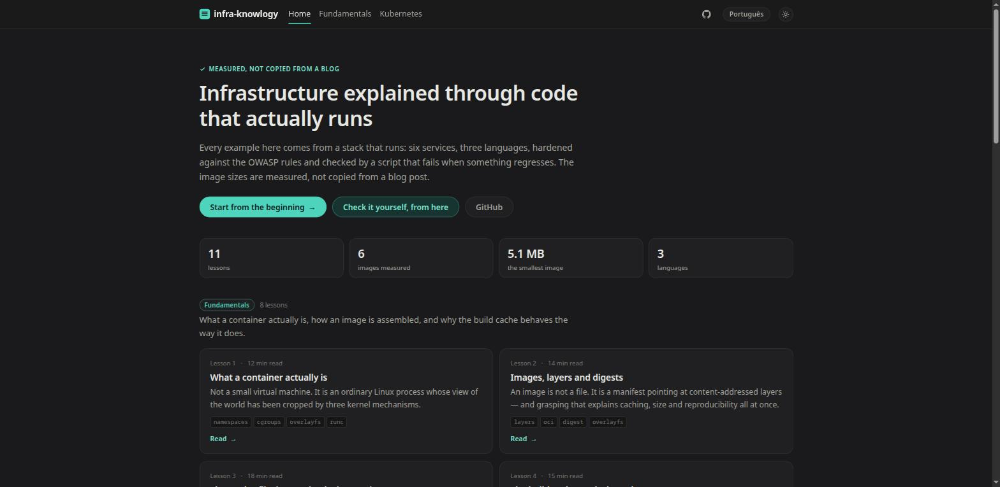
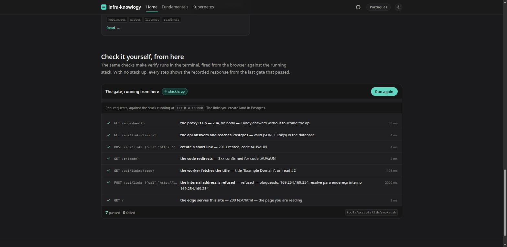
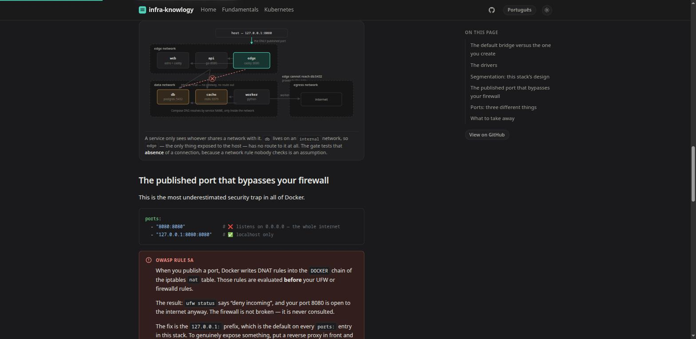
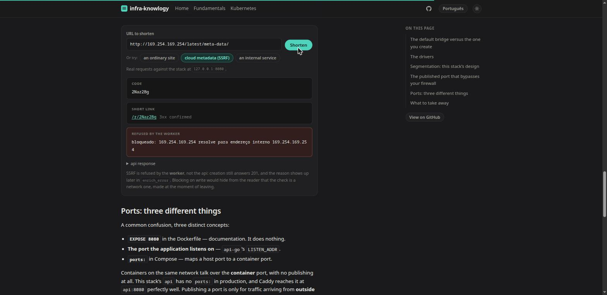

# infra-knowlogy

> **A production stack that actually runs — and the lessons that explain every
> decision in it.** Module 1 is Docker; module 2 ports the same stack to
> Kubernetes. The [roadmap](docs/ROADMAP.md) carries the rest.

The principle tying the whole repository together: **the lessons teach exactly
the code that is here, with numbers measured on this machine.** No generic blog
examples. When the base-image lesson shows a size table, those bytes came from
`docker image inspect` run against these Dockerfiles by `tools/scripts/sizes.sh`.

And the site that teaches multi-stage builds is served by the very multi-stage
Dockerfile it explains.

<p align="center">
  
</p>

The four numbers under the headline are read from `site/src/data/measured.json`
at build time — the same file `tools/scripts/sizes.sh` rewrites on every
`make verify`. Nothing on that page is typed by hand.

### Run the gate from the page, not the terminal

<p align="center">
  
</p>

These are the same seven checks as `tools/scripts/lib/smoke.sh`, fired by the
browser against the stack `make up` just started: create a link, follow the
redirect, wait for the worker to fetch the title, and watch the SSRF guard
refuse `169.254.169.254`. The timings are real, and the links land in Postgres.

It needs no new infrastructure — the edge already serves the site and the API on
the same origin. With no stack up, the widget replays the responses recorded in
`site/src/data/recorded-gate.json`, labelled as recorded, with the date. The
site stays **100% static** either way; see
[ADR 0008](docs/adr/0008-acoes-ao-vivo-no-site-estatico.md).

### Diagrams that are markup, not pictures

<p align="center">
  
</p>

Fifteen hand-written SVG diagrams, at least one per lesson. They inherit the
light/dark theme from CSS custom properties, stay sharp at any zoom, and show up
in `git diff` as text. The gate refuses any SVG carrying a hard-coded colour —
one would be illegible in one of the two themes.

The topology above is the real `stack/compose.yaml`: three networks, six
services, and the connection that **does not exist** (`edge` cannot reach
`db:5432`) — which is check 5 of the gate.

### The SSRF guard, refusing an address while you watch

<p align="center">
  
</p>

Type a URL, or take the cloud-metadata preset, and the whole path happens in
front of you: the api writes, the redirect answers, the worker goes out to fetch
the title — and comes back with the reason it refused. The refusal is the
worker's own message, verbatim, which is why it reads in Portuguese even on the
English page: it is the real response, not a caption.

> A note on languages, so nothing surprises you: the **lessons are bilingual** —
> every one exists in English and Portuguese. This README is English. The **code
> comments and the ADRs are written in Portuguese**: they are the author's
> internal engineering notes, not teaching material. Identifiers, file names and
> URL slugs are always English.

## Start here

```bash
make            # list everything you can do
make up         # bring up the hardened stack and wait for every healthcheck
make site-dev   # open the lessons at http://localhost:4321
make verify     # the quality gate: build, boot, test, and prove the hardening
make site-verify # the site alone — types, tests, build, generated HTML (no Docker)

make k8s-up     # module 2: the SAME stack in a kind cluster, at 127.0.0.1:8081
make k8s-verify # its own gate — 33 checks, from scratch, cluster destroyed after
```

Requirements: Docker 25+ with BuildKit, Docker Compose v2+, Node 22+ (site only),
and `uv` (for `make index` only). Developed and tested on Fedora with SELinux
enforcing.

## The stack

A link shortener with asynchronous enrichment. Small enough to read end to end,
complete enough to exercise everything the lessons need to teach.

```
                    127.0.0.1:8080
                          │
                    ┌─────▼─────┐
                    │   edge    │  Caddy · automatic TLS · never touches the socket
                    └──┬─────┬──┘
              edge net  │     │
                 ┌──────▼─┐ ┌─▼──────┐
                 │  web   │ │  api   │  Go · distroless · 5.7 MB
                 └────────┘ └───┬────┘
                                │  data net (internal: true — NO egress)
                      ┌─────────┼─────────┐
                 ┌────▼───┐ ┌───▼────┐ ┌──▼─────┐
                 │   db   │ │ cache  │ │ worker │  Python · uv · 49.9 MB
                 └────────┘ └────────┘ └───┬────┘
                  Postgres    Redis        │ egress net
                                           ▼ fetches URLs (with an SSRF guard)
```

Look at the network layout: `db` and `cache` sit **only** on the `data` network,
which is `internal: true` — they have no route to the internet, and the proxy
literally cannot reach them. It is an absence of route, not a firewall rule.
`worker` is the studied exception, because it must fetch user-submitted URLs;
that is why its code carries an SSRF guard.

| Service | Language | Final image | What it teaches |
|---|---|---|---|
| `api-go` | Go | 5.7 MB (distroless) | static binary, `scratch`, CA certs, graceful shutdown |
| `worker-py` | Python | 49.9 MB (slim + venv) | multi-stage with `uv`, SIGTERM in a work loop, SSRF |
| `web` | Node → static | 26.2 MB (Caddy) | a build that discards its own runtime |
| `edge` | — | Caddy | reverse proxy without touching the Docker socket |
| `db` / `cache` | — | Postgres 17 / Redis 7 | volumes, healthchecks, `service_healthy` |

`make obs` adds Prometheus, Grafana, Loki, Alloy, cAdvisor, node-exporter and two
exporters — behind the `obs` profile, so day-to-day work still comes up in
seconds instead of paying for fifteen containers.

## The lessons

34 lessons — 17 topics, in English and Portuguese — under
`site/src/content/lessons/`, with 20 hand-drawn SVG diagrams and eight
interactive widgets. The diagrams are written as markup, not exported as
pictures: they inherit the light/dark theme from CSS custom properties, stay
sharp at any zoom and show up in `git diff` as text.

**Fundamentals track:** what a container actually is · images, layers and digests
· the Dockerfile instruction by instruction · the build cache · lifecycle and
exit codes · volumes, bind mounts and tmpfs · networks and internal DNS · Compose
and healthchecks.

**Security track:** what a port actually is, and why scanning the internet is
cheap · remote access (22, 23, 3389) — one family, one stolen credential · 80
and 443, where the poster this track came from gets it backwards: injections
attack the *application* and cross TLS unchanged, while SSL stripping lives on
80 · 25, 53 and 445 — the service working as designed, for somebody else · **how
a database is attacked**, with the four ways in and SQL injection demonstrated
against this stack's own Postgres · layered defense, including the list of what
this stack deliberately does **not** defend. Every claim is tied to a step of
`make attack-lab`; the numbers come from `site/src/data/attack-lab.json`.

**Kubernetes track** (module 2): why an orchestrator — ADR 0001's accepted
limits, measured · from compose.yaml to Deployment, block by block · liveness
vs readiness, with the database outage staged and counted. The numbers these
lessons cite are written by `make k8s-verify` into
`site/src/data/k8s-measured.json`.

**Two kinds of claim, told apart on the page.** Everything this repository
measures is proven by a command in the gate. Plenty of what matters, though,
cannot be measured here: how large organisations actually operate, when a VM
beats a container, what went wrong for somebody else. That knowledge is welcome
— under a different standard of proof. A `FieldNote` is drawn with a dashed
border (a solid one means measured), always names its source and date, and
always prints *"not measured here"*. A `Tradeoff` is refused by the test suite
unless it states **when each side wins**, because a comparison table hands the
decision back to the reader who lacked the background to make it.
[ADR 0009](docs/adr/0009-afirmacao-medida-e-afirmacao-citada.md) records why.

**Every lesson asks something back.** A `Quiz` explains *every* option, the
wrong ones included — a widget that merely paints the right answer green
teaches you to recognise the answer key, not the subject. A `LabExercise` asks
a question whose answer is a command, and names the gate check that proves it.
Two tests fail a lesson that arrives without a diagram, or without an exercise.

**Third-party images, with provenance.** A canonical diagram — the Kubernetes
components one, say — is worth showing as the reader will meet it elsewhere.
`Figure` takes `src` only alongside a visible credit and a license that was
actually checked; the generated HTML is verified for it. The catch this turned
up is recorded in
[ADR 0010](docs/adr/0010-imagens-de-terceiros.md): draw.io SVG exports embed a
**base64 PNG of every text label**, and an `` takes that raster path —
254 KB for the Kubernetes diagram, blurry text, a frozen renderer.
`tools/scripts/flatten-drawio-svg.py` turns the labels back into real `<text>`
and the file drops to 80 KB.

**Run the checks from the page.** Two widgets talk to the running stack instead
of describing it. `GateRunner` fires the same seven checks as
`tools/scripts/lib/smoke.sh` — create a link, follow the redirect, wait for the
worker, watch the SSRF guard refuse an internal address — straight from the
browser; `LinkLab` shortens a URL you type and shows the refusal reason the
worker gave. This needs no new infrastructure: the edge already serves the site
and the API on the same origin, so a `fetch('/api/links')` from the page is
same-origin, with no CORS and no server of its own.

The site is still **100% static**. With no stack up, both widgets replay the
real responses recorded in `site/src/data/recorded-gate.json` — always labelled
as recorded, with the date — and the test suite runs the gate over that file, so
the recording cannot quietly drift from what the gate checks. See
[ADR 0008](docs/adr/0008-acoes-ao-vivo-no-site-estatico.md).

Every lesson ends with a **"Run it yourself"** block — real commands against this
repository's stack, not pseudocode.

Some claims were **measured, and corrected the common wisdom**. For example: the
widespread explanation that `CMD`'s shell form breaks `docker stop` is
incomplete — BusyBox `exec`s a simple command, so `sleep` becomes PID 1 either
way, and *both* forms burn the full ten seconds. The real cause is that **the
kernel applies no default signal dispositions to PID 1**. Lesson 3 carries all
four cases, timed.

## Verification

`make verify` runs nine stages and fails loudly. It does not merely check that
the code compiles — it **proves the lessons' claims**:

- `hadolint` on every Dockerfile, and `config -q` on all three Compose combinations;
- build everything, and rewrite the measured sizes into `measured.json`;
- `up --wait`, which only passes when every healthcheck passes;
- smoke test of the real flow: create a link → 302 redirect → the worker enriches
  it → **an internal URL is rejected by the SSRF guard**;
- hardening proofs: writing to `/` **fails**, the declared `/tmp` works, the uid
  is 65532, no port is bound to `0.0.0.0`, the secret appears in neither
  `docker history` nor `env`, and `edge` **cannot reach** `db`;
- graceful shutdown — fails if any service takes longer than 3 s to stop;
- Trivy failing on HIGH/CRITICAL, with a CycloneDX SBOM per image;
- the site in four layers: `astro check` (types), 70 unit tests, the build, and
  a scan of the **generated HTML** — every internal link and anchor has to
  resolve, both language trees must match, every lesson must ship a diagram or a
  widget, and no SVG may carry a hard-coded colour;
- with the `obs` profile, every Prometheus target must be `up`.

Current state: **32 passed · 0 failed**.

For faster local iteration: `SKIP_SCAN=1 SKIP_OBS=1 make verify` (**27 passed**).
For the site alone, with no Docker at all: `make site-verify`.

Module 2 has its own independent gate, `make k8s-verify` (**33 passed · 0
failed**): it creates a kind cluster from scratch, loads the same images,
applies the manifests, reruns the same smoke test through port 8081, proves the
NetworkPolicies mirror the Compose networks (edge cannot reach db; db has no
route out; the worker cannot touch link-local), and then measures what Compose
cannot do — self-healing, counted restarts, readiness without restarts, and a
rolling update with **zero dropped requests**. It destroys the cluster when done.

The security track has its own gate too, and it runs **inverted**:
`make attack-lab` fires eleven real attacks at the local stack and a check
passes when the attack **fails** — a host port sweep, hitting 5432 directly,
crossing from the proxy to the database, a wrong password against
scram-sha-256, SQL injection through three API entry points, SSRF at the cloud
metadata address, reading the secret out of `env`/`inspect`/`history`, dropping
a webshell onto a read-only rootfs, getting a shell out of a distroless image,
and exfiltrating from a database with no route out. Current state: **10
repelled · 0 succeeded**.

Step 6 is the exception, and it leaks on purpose: it runs the *same* hostile
input two ways against a temporary table inside a rolled-back transaction —
**3 rows** when concatenated into the query text, **0** when passed as a
parameter. No vulnerable endpoint ships in the application; the reasoning is in
[ADR 0013](docs/adr/0013-laboratorio-de-ataque-na-propria-stack.md). The script
refuses to run against anything but this project's containers on `127.0.0.1`.

## Roadmap

One application crosses the whole infrastructure journey; each module is a
deployment view of it, with its own gate. Module 1 (Docker, `stack/`) and
module 2 (Kubernetes, `k8s/`) exist; self-hosted CI/CD with Jenkins, IaC and
configuration management are reserved next. Details, rules and status:
[`docs/ROADMAP.md`](docs/ROADMAP.md) (Portuguese).

## Layout

```
stack/          production code: compose + services/{api-go,worker-py,edge,db,observability}
k8s/            module 2: the same stack as kind + kustomize manifests
site/           the bilingual lessons site (Astro + MDX + React islands)
tools/scripts/  verify · k8s-verify · attack-lab · site-check · sizes · scan · shutdown-test
docs/adr/       why Compose and not k8s, why Caddy and not Traefik, and the rest
docs/ROADMAP.md the modules: done, in progress, reserved
```

Decisions and the alternatives that were **rejected** live in
[`docs/adr/`](docs/adr/) — thirteen records, written in Portuguese. `CLAUDE.md`
records the conventions and the traps
already hit — SELinux and Compose secrets, `cap_drop` breaking `exec()` on a
binary with file capabilities, `build:` without `target:` shipping the wrong
stage — so they are not rediscovered the hard way.

## License

MIT.
